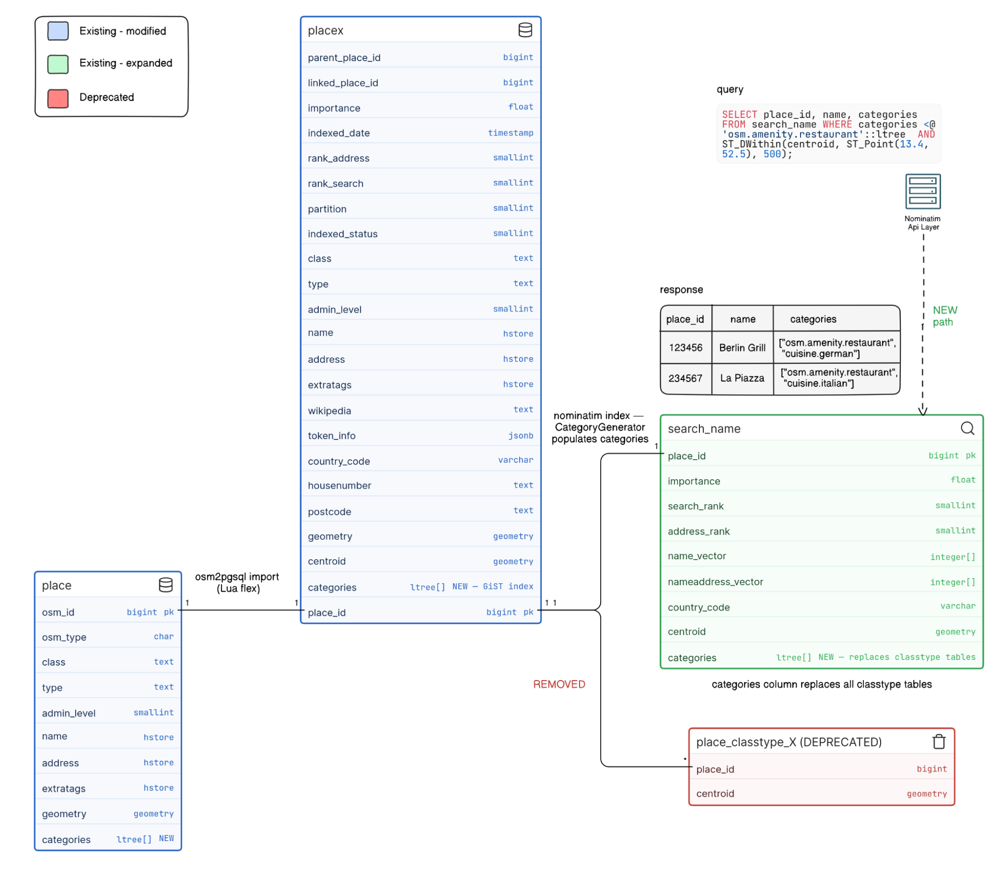
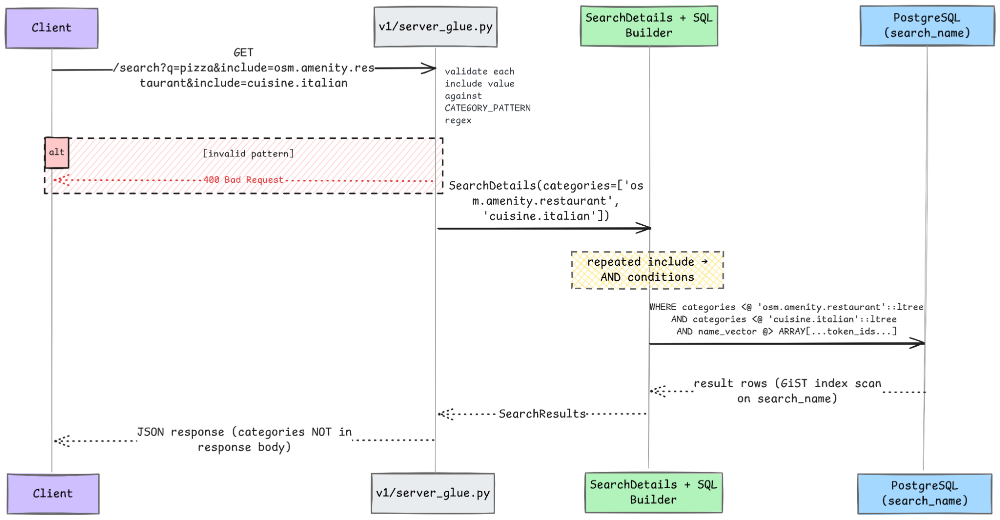

<p align="center">
  
</p>

<h1 align="center">GSoC 2026 Project Proposal</h1>

<p align="center">
  
</p>

<h1 align="center">Category Support in Nominatim</h1>

<div align="center">

| Legal Name  | Rupam Golui                                                                                                    |
| :---------- | :------------------------------------------------------------------------------------------------------------- |
| Time Zone   | IST (UTC+05:30)                                                                                                |
| Email       | [rupamgolui69@gmail.com](mailto:rupamgolui69@gmail.com), [rupam.golui@proton.me](mailto:rupam.golui@proton.me) |
| OSM Profile | [Agasta07](https://www.openstreetmap.org/user/Agasta07)                                                        |
| GitHub      | [Itz-Agasta](https://github.com/Itz-Agasta)                                                                    |
| X           | [idkAgasta](https://x.com/idkAgasta)                                                                           |
| Languages   | English                                                                                                        |
| Designation | Bachelor of Technology in Computer Science (2024–2028)                                                         |

</div>

# Abstract

Nominatim currently identifies the type of a searchable place using a single OSM class/type pair. While this approach is simple and directly derived from OpenStreetMap tags, it has three fundamental limitations:

1. **Duplicate entries for multi-tagged objects:** A single OSM object with multiple "main" tags (e.g., tourism=hotel + amenity=restaurant) creates separate entries in the **place** and **placex** tables. This introduces complex logic in import, update, and query paths, wasteful for tables that are already among the largest in the database.

2. **Fragile handling of administrative boundaries:** Currently the pair boundary=administrative cannot distinguish between a country, a state, and a municipality. Nominatim works around this by piggybacking on admin_level, a hack that makes the code awkward in many places.

3. **Insufficient granularity for modern search:** Users increasingly want to search for concepts like "vegan restaurant" or "wheelchair-accessible cafe," but a single OSM tag cannot express this nuance.

The Photon geocoder recently introduced a **category system** ([v1.0.0, February 2026](https://github.com/komoot/photon/blob/master/CHANGELOG.md#:~:text=add%20categories%20and%20category%20filters)) that addresses some of issues using hierarchical, dot-separated labels (e.g., osm.amenity.restaurant, cuisine.italian). This project brings equivalent category support to Nominatim's PostgreSQL backend.

---

Based on my discussions with the mentors, the core scope for GSoC focuses on getting the database scaffolding in place for the category concept:

1. **Database infrastructure:** Add a categories column to the place, placex, and search_name tables, with appropriate indexing for hierarchical queries.

2. **Lua-based category generation:** Assign fixed categories of the form `osm.<class>.<type>` in the Lua import scripts, the same approach Photon's [PlaceRowMapper](https://github.com/komoot/photon/blob/master/src/main/java/de/komoot/photon/nominatim/model/PlaceRowMapper.java#L36:L61) already uses. The Lua layer has access to all raw OSM tags and is the natural place for this assignment.

3. **Search integration:** Replace the per-(class, type) materialized `place_classtype_*` tables with category-based filtering directly in search_name/placex table.

4. **Migration:** Support existing installations through online-compatible schema migration and backfill.

**Stretch goals** (if time permits) a flexible CategoryGenerator with YAML-driven rules (for cuisine.italian, access.wheelchair.yes, etc.), and exposing include/exclude API parameters matching Photon's interface. The existing class and type columns will remain as passive information - too many API consumers rely on receiving OSM tag information in responses. Categories replace their role in _search filtering_, not in _result presentation_.

I've been working on open source for almost [two years](https://github.com/Itz-Agasta) now. One of the most rewarding aspects of open source development for me is seeing improvements directly benefit real users and developers. OSM represents one of the most impactful open data ecosystems in the world. I have learned immensely from the contributions I've made to Nominatim in the past few months. Other than implementing my project, through this project I would like to understand how open source work goes in bigger organizations like OSM and become a part of this community.

My previous contributions to Nominatim include:

| PR                                                         | Description                                                                                                                                                                                                                                                                                       | Status   |
| ---------------------------------------------------------- | ------------------------------------------------------------------------------------------------------------------------------------------------------------------------------------------------------------------------------------------------------------------------------------------------- | -------- |
| [#3981](https://github.com/osm-search/Nominatim/pull/3981) | Implemented a lazy-loading search endpoint with async locking across Falcon and Starlette ASGI backends.                                                                                                                                                                                          | Merged   |
| [#3995](https://github.com/osm-search/Nominatim/pull/3995) | Fixed a ranking bug where a country's translated name outranks the intended city result (e.g. searching "Brasilia" in Finnish returns Brazil first, because its Finnish name is "Brasilia"). Implemented language-aware penalty in ForwardGeocoder.rerank_by_query using Accept-Language headers. | Merged   |
| [#3949](https://github.com/osm-search/Nominatim/pull/3949) | Centralized all scattered GRANT statements from across SQL files into a single lib-sql/grants.sql Jinja template; added `nominatim refresh --ro-access` command.                                                                                                                                  | Merged   |
| [#3951](https://github.com/osm-search/Nominatim/pull/3951) | Added `--layer` filtering parameter to `nominatim search` CLI.                                                                                                                                                                                                                                    | Merged   |
| [#3943](https://github.com/osm-search/Nominatim/pull/3943) | Replaced `eval()` with `ast.literal_eval()` in BDD test utilities. eval() on test fixture strings was an arbitrary code execution risk                                                                                                                                                            | Merged   |
| [#4015](https://github.com/osm-search/Nominatim/pull/4015) | Implemented re-parenting of house numbers when associatedStreet relations change.                                                                                                                                                                                                                 | Merged   |
| [#4049](https://github.com/osm-search/Nominatim/pull/4049) | Added pyproject.toml with uv workspace configuration and dev dependency groups, enabling contributors to use uv as a faster alternative to virtualenv + pip for dev environment setup.                                                                                                            | Merged   |
|                                                            | Extend language-aware reranking to all address parts. Follow-up to PR #3995 fixes ranking bug by collecting localized names from all address parts (not just countries) & apply the language-preference-aware penalty                                                                             | Assigned |

# Technical Plan

## 1. Background & Motivation

Geocoding requires not just finding places by name but also filtering them by **what they are**. A user searching for _"restaurants near Berlin"_ needs to classify places into semantic categories. This is now standard across the industry. Commercial systems like [HERE Maps](https://www.here.com/docs/bundle/geocoding-and-search-api-developer-guide/page/topics-places/places-category-system-full.html) organize places into hierarchical categories (e.g., `100-1000-0000` for restaurants), [Foursquare](https://docs.foursquare.com/data-products/docs/categories) maintains a 10-level taxonomy with 1,000+ categories, and [Google Places](https://developers.google.com/maps/documentation/places/web-service/place-types) exposes type hierarchies like `restaurant` → `italian_restaurant`. The [Overture Maps Foundation](https://github.com/OvertureMaps/schema/blob/dev/docs/schema/concepts/by-theme/places/overture_categories.csv) similarly maintains structured category systems for places. But today in Nominatim, this is handled through several separate, loosely-connected mechanisms:

| Mechanism                     | Scope                                                     | Limitation                                                                    |
| ----------------------------- | --------------------------------------------------------- | ----------------------------------------------------------------------------- |
| **OSM class/type**            | Single key-value pair per place in placex                 | Only one classification per row; multiple "main" tags → duplicate rows        |
| **Admin level**               | Distinguishes administrative boundary ranks               | Hard-coded workaround; special-cased everywhere boundaries appear in the code |
| **Special Phrases**           | Maps natural-language terms → (class, type) pairs         | One-dimensional; tied to OSM tag vocabulary; cannot express custom taxonomies |
| **place*classtype*\* tables** | Materialized spatial indexes per (class, type)            | One table per combination; rigid and hard to extend                           |
| **DataLayer enum**            | 5 coarse layers (ADDRESS, POI, RAILWAY, NATURAL, MANMADE) | Too coarse for meaningful filtering                                           |

Categories solve the three problems described in the abstract:

- **Multi-membership without duplication**: A hotel-restaurant gets categories `{osm.tourism.hotel, osm.amenity.restaurant}` in a single placex row instead of two separate rows. This is significant - placex is already among the largest tables in the database.
- **Structured boundary classification**: Instead of hacking admin_level checks everywhere, `osm.boundary.administrative.4` (state) is structurally distinct from `osm.boundary.administrative.8` (municipality), and querying `osm.boundary.administrative` matches all of them through hierarchy.
- **Arbitrary granularity**: Beyond raw OSM tags - categories like `cuisine.italian` or `access.wheelchair.yes` capture things a single class/type cannot.
- **Eliminated table proliferation**: One indexed column in search*name replaces all `place_classtype*\*` tables and their maintenance triggers.

**How Photon does it, for context**: Photon stores categories as `Set<String>` in PhotonDoc, indexed via an OpenSearch `index_categories` analyzer that uses a `pattern_capture` token filter to decompose `osm.amenity.restaurant` into prefix tokens `{osm.amenity, osm.amenity.restaurant}` at index time. The keyword search analyzer then matches any prefix for hierarchical filtering. Nominatim needs equivalent functionality using PostgreSQL's native capabilities.

## 2. Design

### 2.1 Choosing a Data Type

This is probably the most important design decision for the whole project, and I don't want to lock it in before benchmarking on real data. Here's what I've been looking at:

| Approach                                                                                         | Hierarchical queries                                    | Storage                                               | Complexity | Notes                                                                                                                                                                                                                                                                                                                   |
| ------------------------------------------------------------------------------------------------ | ------------------------------------------------------- | ----------------------------------------------------- | :--------: | ----------------------------------------------------------------------------------------------------------------------------------------------------------------------------------------------------------------------------------------------------------------------------------------------------------------------- |
| **[ltree[]](https://www.postgresql.org/docs/current/ltree.html)**                                | Native — `<@` operator checks descendant paths directly | Compact (store raw categories, no prefix duplication) |    Low     | Requires `CREATE EXTENSION ltree`; [PostgreSQL 16+ supports hyphens in labels](https://www.postgresql.org/docs/16/release-16.html#:~:text=Change%20the%20maximum%20length%20of%20ltree%20labels%20from%20256%20to%201000%20and%20allow%20hyphens%20%28Garen%20Torikian%29), which aligns with Photon's CATEGORY_PATTERN |
| **[TEXT[] with prefix expansion](https://www.postgresql.org/docs/current/functions-array.html)** | Manual — store all prefixes, use `&&` for overlap       | Larger (every prefix stored explicitly)               |   Medium   | No extension dependency; same principle as Photon's [split_category](https://github.com/komoot/photon/blob/master/src/main/java/de/komoot/photon/opensearch/IndexSettingBuilder.java#L200-L208) token filter                                                                                                            |
| **[INTEGER[] with range encoding](https://www.postgresql.org/docs/current/rangetypes.html)**     | Numeric range containment                               | Most compact                                          |    High    | Needs a category-to-integer mapping table; a lot more code to maintain                                                                                                                                                                                                                                                  |

During the discussion, mentors suggested exploring `ltree` for representing hierarchical categories. After reviewing the [documentation](https://www.postgresql.org/docs/current/ltree.html#:~:text=F%2E22%2E4%2E%C2%A0Example%20%23) and experimenting with its capabilities, it also appears to be a natural fit to me. With `ltree[]`, hierarchical queries just work:

```sql
-- A restaurant stores: {osm.amenity.restaurant, cuisine.italian}
-- No prefix expansion needed — ltree handles hierarchy natively

-- "Find all amenities" (restaurants, cafes, bars, etc.)
WHERE categories <@ 'osm.amenity'::ltree

-- Exact match
WHERE 'osm.amenity.restaurant'::ltree = ANY(categories)
```

Compare this to the **TEXT[]** approach where I'd need to pre-compute and store every prefix (`{osm.amenity, osm.amenity.restaurant}`) to make a simple `&&` overlap query work. ltree does the same thing with less storage and less application code. That said, I want to actually **benchmark both** during community bonding on a real planet extract before committing. If ltree has weird edge cases or poor GiST index performance at scale, TEXT[] with GIN is a solid fallback - it exactly mirrors how Photon's `split_category` filter works at the OpenSearch level.

### 2.2 Schema Changes

The schema changes will touch three separate tables, and each one has its own mechanics. So instead of one giant PR, this naturally breaks into steps, each one standalone and reviewable on its own.

**Step 1 — place table**

The place table is defined in the Lua flex output (`lib-lua/themes/nominatim/init.lua`). This is where the column first needs to exist. Lua has access to all raw OSM tags at import time and class/type are assigned here also. This is the same approach Photon's PlaceRowMapper uses: construct `osm.<class>.<type>` from the tag key and value.

```lua
place = {
    columns = {
        { column = 'class', type = 'text', not_null = true },
        { column = 'type', type = 'text', not_null = true },
        -- ... existing columns ...
        { column = 'categories', sql_type = 'ltree[]' },  -- NEW
    },
}
```

Edge cases (invalid characters for ltree labels in some class/type values, the place extratag override that PlaceRowMapper handles, bridge name hacks) get sorted out during implementation.

**Step 2 — placex table**

placex is created with `LIKE place INCLUDING CONSTRAINTS` (in `lib-sql/tables/placex.sql`), so it automatically picks up the new column on fresh installs. Then add an appropriate index:

```sql
-- For ltree[] (preferred):
CREATE INDEX idx_placex_categories ON placex
  USING GIST(categories gist__ltree_ops)
  WHERE categories IS NOT NULL;

-- For TEXT[] (fallback):
CREATE INDEX idx_placex_categories ON placex
  USING GIN(categories)
  WHERE categories IS NOT NULL;
```

The `placex_insert()` trigger already copies columns from place to placex, it'll need a small addition to copy categories too.

**Step 3 — search_name table**

This is the important one. `search_name` (`lib-sql/tables/search_name.sql`) is the primary lookup table for forward search — it holds `name_vector`, `nameaddress_vector`, ranks, and `centroid` for spatial filtering. Currently it has **no class/type information at all**. POI filtering happens through separate `place_classtype_*` tables that SPImporter materializes for each (class, type) pair used in special phrases.

Adding categories directly to search_name means those classtype tables become unnecessary:

```sql
ALTER TABLE search_name ADD COLUMN categories ltree[];

CREATE INDEX idx_search_name_categories ON search_name
  USING GIST(categories gist__ltree_ops)
  WHERE categories IS NOT NULL;
```

The existing `create_poi_search_terms()` function in `placex_triggers.sql` already populates search_name entries for POIs (rank_search > 27). That's where category propagation hooks in.

**Alternative:** The existing `place_classtype_*` tables are effectively a pre-filtered spatial index of placex rows. A GiST index on **placex.categories** with a partial index on **centroid** achieves the same thing without a separate table - `poi_search.py` and `near_search.py` already have a Strategy A that queries placex directly for small radii (`near_radius < 0.2`). This approach may generalize that strategy.

The right choice depends on query performance at scale. Both are architecturally sound. I'll decide based on benchmarks on a real planet extract.

**Step 4 — Replacing place*classtype*\* tables**

Currently `SPImporter._create_place_classtype_table()` creates a materialized table per (class, type) pair — e.g., `place_classtype_amenity_restaurant` containing `(place_id, centroid)`. These get maintained by INSERT/DELETE trigger logic in `placex_insert()` and `placex_delete()`. With categories in search_name, the same query gets simpler:

| Before                                                                                    | After                                                                                                                |
| ----------------------------------------------------------------------------------------- | -------------------------------------------------------------------------------------------------------------------- |
| `SELECT place_id FROM place_classtype_amenity_restaurant WHERE ST_DWithin(centroid, ...)` | `SELECT place_id FROM search_name WHERE categories <@ 'osm.amenity.restaurant'::ltree AND ST_DWithin(centroid, ...)` |

search*name already has a spatial index on **centroid**, so this works out of the box. This eliminates the `place_classtype*\*`tables, their triggers, and the temp`idx_placex_classtype` index that SPImporter creates during import. The POI search (`poi_search.py`) and Near search (`near_search.py`) paths in the API layer would need updating to query `search_name.categories` instead of the classtype tables.

<p align="center">
  
</p>

<p align="center"><em>Fig 1. Proposed Nominatim DB schema — categories[] column in search_name replaces place_classtype_* tables. Categories are populated via CategoryGenerator (stretch) and queried directly by the API layer.</em></p>

### 2.3 Category Generation in Lua

The Lua flex scripts are the right place to assign the initial fixed categories. Specifically, in `lib-lua/themes/nominatim/init.lua`, the `Place:write_row(k, v)` function is called once per main tag match. This is where `class = k` and `type = v` are written to the place table. The categories column gets populated here:

```lua
function Place:write_row(k, v)
    -- ... existing tag filtering ...
    insert_row.place{
        class = k,
        type = v,
        -- ... other fields ...
        categories = {string.format("osm.%s.%s", k, v)},  -- NEW
    }
    return 1
end
```

This is exactly what Photon's `PlaceRowMapper.java` does:

```java
.categories(List.of(String.format("osm.%s.%s", osmKey, osmValue)))
```

**Edge cases to handle during implementation**:

- class/type values with characters not valid in ltree labels (e.g. `-`, which requires PostgreSQL 16+, or spaces) — need sanitization matching PlaceRowMapper's `CATEGORY_PATTERN` check
- The place extratag override in PlaceRowMapper: when extratags contains a place key, Photon overrides `osmKey`/`osmValue` — whether Nominatim needs the same handling will become clear during implementation
- Bridge names and other hacks in the existing Lua scripts that affect class/type assignment

Since placex is created with `LIKE place INCLUDING CONSTRAINTS`, the categories column propagates automatically to placex on fresh installs. The `placex_insert()` trigger in `placex_triggers.sql` copies columns from place to placex, it will need a small addition to copy categories too.

### 2.3b CategoryGenerator (Stretch Goal)

The YAML-driven CategoryGenerator with rules for cuisine.italian, access.wheelchair.yes, and `osm.boundary.administrative.{admin_level}` is a stretch goal. After discussions with mentors, I understand that **we don't yet know what people want to use categories for**, so a flexible system is premature before the foundation is validated. The simple `osm.<class>.<type>` approach mentioned above is enough to establish the data model during GSoC period.

If time permits, a CategoryGenerator in `src/nominatim_db/data/` would load rules from a new configuration file `settings/category-rules.yaml` and run in the indexer (where extratags like cuisine are fully available, since the indexer receives the complete placex row including extratags). The rule format described below is a sketch, the actual format would be designed based on real use cases:

```yaml
rules:
  - match: { class: [amenity, tourism], extratag: cuisine }
    category: "cuisine.{value}"
    split: ";"
  - match: { extratag: wheelchair, value: [yes, limited] }
    category: "access.wheelchair.{value}"
  - match: { class: boundary, type: administrative }
    category: "osm.boundary.administrative.{admin_level}"
```

I believe YAML will be best for this design — the same reason tools like Docker Compose and GitHub Actions use it. Rules like "if class is amenity and extratag cuisine exists, emit cuisine.{value}" are essentially structured conditions, and YAML expresses them cleanly without the noise of JSON brackets or the rigidity of a Python config; also it's easy to maintain.

### 2.4 API Layer (Stretch Goal)

If the core database work lands early enough, the next thing to do is expose category filtering through the API. Photon has established clear semantics in its [docs/categories.md](https://github.com/komoot/photon/blob/master/docs/categories.md) that users already understand, so there's no reason to invent something different:

| Parameter                     | Syntax                                           | Semantics                                        |
| ----------------------------- | ------------------------------------------------ | ------------------------------------------------ |
| **include**                   | `include=osm.amenity.restaurant`                 | Match places with this category (or descendants) |
| **include (repeated)**        | `include=osm.amenity&include=cuisine.italian`    | Match places with **all** categories (AND)       |
| **include (comma-separated)** | `include=osm.amenity.restaurant,cuisine.italian` | Match places with **any** category (OR)          |
| **exclude**                   | `exclude=food.fast_food`                         | Exclude places with this category                |
| **exclude (repeated)**        | `exclude=food.chain&exclude=food.fast_food`      | Exclude if **any** matches (OR)                  |
| **exclude (comma-separated)** | `exclude=food.fast_food,food.chain`              | Exclude only if **all** present (AND)            |

Validation uses the same `CATEGORY_PATTERN` from Photon's [PhotonDoc.java](https://github.com/komoot/photon/blob/master/src/main/java/de/komoot/photon/PhotonDoc.java#L22-L24), each category needs at least two dot-separated labels; invalid patterns return 400 Bad Request. Categories are filter-only and not returned in responses, same as Photon.

The [SearchDetails](https://github.com/osm-search/Nominatim/blob/master/src/nominatim_api/types.py/#L570-L574) dataclass in `src/nominatim_api/types.py` already has a `categories: List[Tuple[str, str]]` field for class/type-based filtering, the new system would replace this with string-based category filters. Parameter parsing would go in `src/nominatim_api/v1/server_glue.py`, following the existing pattern for `layer` and `country-codes`.

<p align="center">
  
</p>

<p align="center"><em>Fig 2. API request flow for category filtering — valid include params are validated against CATEGORY_PATTERN, mapped to AND conditions in SQL, and queried directly against search_name.categories via GiST index.</em></p>

**I'm marking this as a stretch goal** because the database work is the hard part and I don't want to rush it. The API layer is comparatively straightforward once categories are populated and indexed, it's mostly parameter parsing + SQL condition building.

### 2.5 Migration

**Fresh installs** just work — the updated place Lua definition includes categories, placex inherits it via LIKE, and search_name gets it from the updated SQL.

**Existing installs** use `nominatim admin --migrate`. The migration framework in `src/nominatim_db/tools/migration.py` uses version-tagged `@_migration` decorators. This project adds the next migration version after the current latest in tree:

```python
@_migration(5, 2, 99, 5)
def add_categories_columns(conn: Connection, **_: Any) -> None:
    """Add categories column and index to place, placex, and search_name."""
    # ALTER TABLE ... ADD COLUMN IF NOT EXISTS ...
    # CREATE INDEX IF NOT EXISTS ...
```

`ALTER TABLE ADD COLUMN IF NOT EXISTS` is safe against a live table. Existing rows get NULL, so **all existing queries keep working** - any `WHERE categories <@ ...` clause simply returns no rows for un-populated places, and queries without category filters are completely unaffected.

**Backfilling** existing installs will use an online SQL migration path by default, not a reimport. Because legacy rows were imported before categories existed, categories must be initialized explicitly from existing class/type values. The migration helper will populate `place.categories` with a deterministic mapping (`osm.<class>.<type>`) and then propagate to placex and search_name. This approach keeps Nominatim online while migration runs; category-filtered queries may return partial coverage until backfill completes, while non-category queries remain unaffected. A full reimport remains an optional fallback for operators who prefer rebuilding from scratch.

**Frozen databases** (`nominatim freeze` drops the place table and update infrastructure): since frozen databases skip the indexer, categories can't be backfilled post-freeze. The migration adds the column but leaves it unpopulated - which is fine; frozen databases are read-only snapshots.

# Work Packages

I want each piece of work to produce a standalone PR that's useful on its own, even if later packages build on it. This way progress stays visible and reviewable, if one PR needs rework, it doesn't block everything else.

| #   | Work Package                            | Depends on | Deliverable                                                                                                                | Tests                                                            |
| :-- | :-------------------------------------- | :--------: | -------------------------------------------------------------------------------------------------------------------------- | ---------------------------------------------------------------- |
| WP1 | Schema: categories column               |     —      | Add column to place/placex Lua def + SQL; migration for existing installs                                                  | Column exists on fresh import and after migration; index created |
| WP2 | Lua category generation                 |    WP1     | Assign `osm.<class>.<type>` in `Place:write_row`; handle edge cases                                                        | Fresh import: categories populated in place and placex           |
| WP3 | Search index + replace classtype tables |    WP2     | Add categories to search index (Option A or B, TBD); update `poi_search.py` + `near_search.py`; deprecate classtype tables | BDD tests: POI/Near search results unchanged after migration     |
| WP4 | Migration tooling                       |    WP1     | SQL backfill helper in `nominatim admin --migrate`; docs                                                                   | Existing install: categories backfilled without reimport         |
| WP5 | API include/exclude _(stretch)_         |    WP3     | Parameter parsing in `server_glue.py`; SQL generation in search backends                                                   | BDD tests for include/exclude AND/OR semantics                   |
| WP6 | CategoryGenerator _(stretch)_           |    WP2     | YAML rule system; cuisine, wheelchair, admin_level categories                                                              | Unit tests; enriched categories present in placex after re-index |
| WP7 | Special phrases rework _(stretch)_      |    WP3     | Special phrases → category lookups instead of classtype tables                                                             | Existing special phrase queries still work                       |

WP1 and WP4 can be developed in parallel. WP3 is the convergence point where schema + generation + search all come together.

# Timeline

As I've already contributed to Nominatim and am familiar with both the Python API layer and the SQL schema, I will be using the community bonding period for design finalization and experiments.

**Community Bonding — May 1–24**

- Set up the real planet extract on the server for benchmarking
- **Benchmark ltree[] vs TEXT[]** — hierarchical query performance, index size, write overhead. Finalize the data type decision.
- **Finalize search index approach** — Option A (search_name.categories) vs Option B (direct placex index). Run realistic POI/Near queries on both and measure latency. Discuss findings with mentors before WP3.
- Identify edge cases: frozen databases, admin_level values outside standard range, multi-value extratags

---

**Week 1–2 — May 25 – June 9 | WP1: Schema**

- **PR 1 (WP1):** Add categories ltree[] (or TEXT[]) column to place Lua definition; add column + index to placex via SQL; write migration function in `migration.py`
- **Tests:** column exists on fresh install; column exists after `nominatim admin --migrate`; index created; re-run is idempotent
- **Tests:** `placex_insert()` trigger correctly copies categories from place to placex

---

**Week 3–4 — June 10 – June 23 | WP2: Lua Category Generation**

- **PR 2 (WP2):** Populate categories in `Place:write_row` in `init.lua` — assign `{osm.<class>.<type>}` at import time
- Handle edge cases discovered during community bonding (invalid ltree label characters, etc.)
- Integration test: import a node/way/relation, verify categories column is populated in place and placex
- Verify `placex_insert()` trigger propagation

**Midterm evaluation — ~July 14**

At midterm: categories column in place + placex, populated at import time, schema migration working. This is the foundation everything else builds on.

---

**Week 5–7 — June 24 – July 14 | WP3: Search Index + Replace Classtype Tables**

- **PR 3 (WP3a):** Add categories to search index (chosen approach from benchmarks); update `placex_update` trigger to propagate categories
- **PR 4 (WP3b):** Update `poi_search.py` and `near_search.py` to query the new column instead of classtype tables; deprecation path for SPImporter classtype table creation
- **BDD tests:** verify POI and Near search produce identical results before and after the migration

---

**Week 8 — July 15 – July 21 | WP4: Migration Tooling**

- **PR 5 (WP4):** SQL backfill helper (`UPDATE place SET categories = ...` + propagation to placex) in migration framework
- Document migration path in `docs/admin/Migration.md`
- Test: existing install gets correct categories via backfill without reimport

---

**Week 9–10 — July 22 – August 4 | Stretch Goals + Testing**

- If core work is solid: **PR 6 (WP5)** — include/exclude API params in `server_glue.py` and `types.py`
- And/or: **PR 7 (WP6)** — YAML-driven CategoryGenerator for enriched categories
- Full BDD test suite pass; fix regressions

---

**Week 11–12 — August 5 – August 25 | Buffer + Final Polish**

- Address all review feedback on open PRs
- Performance benchmarks on planet extract: indexing overhead, query latency impact
- Final documentation cleanup; CI green
- Submit final evaluation

# Why Me

Last winter, during a hackathon, I was building a [visualization platform for ARGO floats](https://github.com/Itz-Agasta/Atlas) across the world's ocean data. I needed a map component and chose Leaflet (2d) and Mapbox (3d), but I kept hitting a wall: where does all this map data actually come from? That led me to PostGIS, then OSM, and eventually Nominatim's codebase. It started as a curiosity about map data, turned into something I genuinely wanted to understand deeply.

Since then I've worked across different layers of the codebase through my contributions. I've touched the SQL layer (centralizing GRANT statements in [#3949](https://github.com/osm-search/Nominatim/pull/3949)), the CLI (adding layer filtering in [#3951](https://github.com/osm-search/Nominatim/pull/3951)), and async patterns (implementing the lazy-loading endpoint in [#3981](https://github.com/osm-search/Nominatim/pull/3981) that works across both Falcon and Starlette). Working on these parts of the system gave me a much clearer understanding of how the database schema, indexing pipeline, and API layer interact. Because the category system touches many of these same areas, this experience helps me approach the project with a good understanding of how the pieces fit together. Each PR taught me something new about the architecture, and it also made me more confident navigating the codebase.

This project matters to me because I've already hit the class/type limitation in my own dev work. It's a real problem, and implementing it will make future work smoother for everyone building on top of Nominatim, through which I can add real value to the OSS community. Even after the GSoC period ends I want to work on Lua category generation as proposed. I want to be a long-term contributor to this project, and keep adding value to improve OSM and the wider open-source ecosystem around it.

---

<p align="center">
  <em>AI tools were used in a limited capacity to assist with refining my understanding and organizing the project timeline. The proposal, technical ideas, and writing are entirely my own work and have been carefully reviewed by me.</em>
  <br />
  <em>I confirm that I am applying only to this project and organization under Google Summer of Code 2026.</em>
</p>
